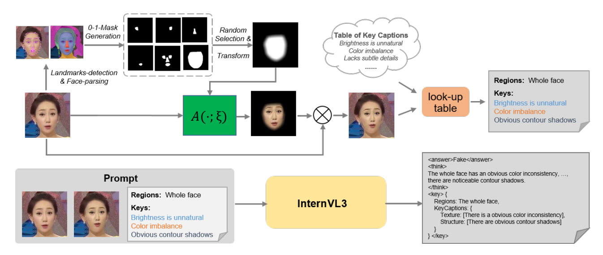
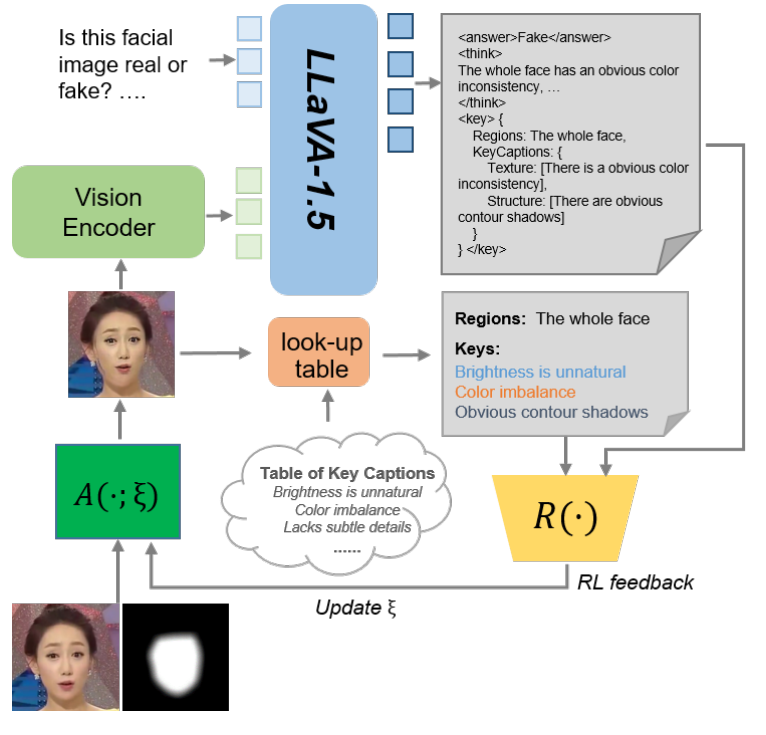
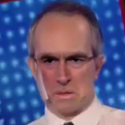
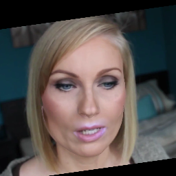
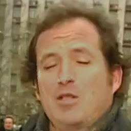
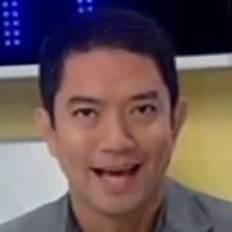
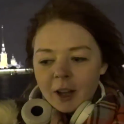
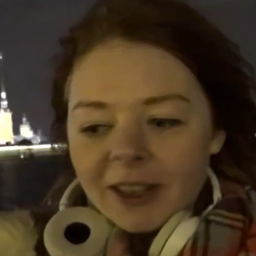
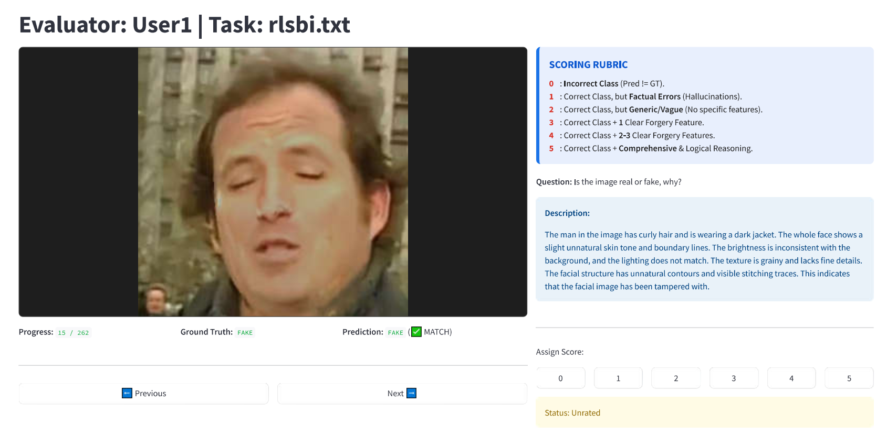

# Explainable Deepfake Detection with RL-Enhanced Self-Blended Images

This repository presents the experimental results and implementation for our paper **Explainable deepfake detection using reinforcement learning enhanced self-blended images**(Under Review). Our work addresses the critical need for interpretable deepfake detection methods while reducing annotation costs through automated data generation.


# 1. Data Generation Pipeline

<div align="center"></div>

First, using a randomly selected mask and perturbation parameters to generate a fake image. Then retrieve key captions from the lookup table based on the mask and parameters. Finally, feed the image pair and key captions into an MLLM to produce the corresponding CoT annotation.

## Details about the **Key Caption Table**
（1) Quantify the differences between the real face image and the corresponding self blend image.

 **A.** We will record augmentation parameters when manipulating a real face image, including color, brightness, saturation, compression, translation, sharpen and affine transformation.
 - Color: we use the Euclidean distance to measure the color difference between pixels in LAB space. Specifically, we calculate the average pixel color difference in the mask region as a quantitative metric. 
 - Brightness: In the YCrCb color space, we measure the relative brightness difference by calculating the disparity of values in the luminance channel (Y-channel) within the mask region.
 - Saturation: In the HSV color space, calculate the difference corresponding to the saturation channel (S-channel) within the mask region. 
 - For compression, translation, sharpen and affine transformation, we use the parameters as the differences directly.
   
 **B.** Threshold setting: By observing the differences between edited images and their corresponding real images under various quantified difference values, we set three kinds of threshold: imperceptible to the naked eye, slight, and obvious. Take color difference as an example:
   
   | threshold | level | 
   |-----------|-------|
   |<5|imperceptible to the naked eye (it will be ignored during generating captions)|
   |5~10|slight|
   |>10|obvious|
 
（2) The construction of Caption Table:
 For different editing operations and editing scopes (full face vs. local), design corresponding rule-based texts by hands:
 - For color differences, preset texts include "There is a [#level] color inconsistency", "There is a [#level] unnatural skin tone", etc.
 - For brightness differences, preset texts include "Brightness is unnatural", "Lighting is inconsistent with the background", etc.
 - For images with sharpening operations: "There is a [#level] graininess", "There is a [#level] striping effect", etc.
 - ......
   
（3) We will select the matched caption according to the augment parameters.

# 2. Framework

<div align="center"></div>

The feedback-based GRPO training. Dynamically adjust the data generation parameters based on computed historical reward values.

# 3. Explainability Results

The table below displays samples and their corresponding textual descriptions generated by our method and the textual annotations from DDVQA[1] dataset, The images are from [2][3]:

| Image                                                        | RLSBI                                                        | DDVQA                                                        |
| ------------------------------------------------------------ | ------------------------------------------------------------ | ------------------------------------------------------------ |
|  <br>manipulated_sequences/Deepfakes/<br>c23/frames/314_347/000.png | The man in the image is dressed in a suit and glasses, with a white shirt. The whole face shows a slight unnatural skin tone and boundary lines. <br>The brightness is not harmonious with the background, leading to an unnatural look. The skin texture is smooth and lacks detail, with an obvious stitching effect. The facial structure has unnatural contours. This facial image has been edited. | The image looks fake. It looks like an ai-generated image although with human appearance but with unrealistic texture or lighting. The person's eyes look a bit fake because the eyes look unnaturally asymmetric. The person's eyebrows look a bit fake because the eyebrows look asymmetric. The person's mouth looks a bit fake because the mouth is misaligned with other facial features. |
|  <br>manipulated_sequences/Face2Face/<br>c23/frames/418_507/000.png | The image shows a woman with blonde hair and makeup, including eyeshadow and lipstick. The entire face appears to have a slight unnatural skin tone, indicating possible tampering. Additionally, the lighting seems inconsistent with the background, suggesting an unnatural brightness. There are also noticeable contour shadows, which might indicate alterations in the face's structure. This suggests that the facial image has been edited. | The image looks fake. It is an image with manipulated face regions. The person's skin looks a bit fake because the skin is overly smooth and lacks of details, such as skin texture. |
|  <br>manipulated_sequences/Face2Face/<br>c23/frames/953_974/000.png | The man in the image has curly hair and is wearing a dark jacket. The whole face shows a slight unnatural skin tone and boundary lines. The brightness is inconsistent with the background, and the lighting does not match. The texture is grainy and lacks fine details. The facial structure has unnatural contours and visible stitching traces. This indicates that the facial image has been tampered with. | The image looks fake. It is an image with manipulated face regions. The person's eyes look a bit fake because the eyes appear overly large to the face the person's nose looks a bit fake because the nose do not align properly with other facial features. The person has mismatched beard. |
|  <br>original_sequences/youtube/<br>c23/frames/036/000.png | The man in the image has short dark hair and is wearing a light-colored shirt. The whole face displays an accurate and natural skin tone that is evenly toned. The lighting is natural and harmonious, consistent with environmental lighting. The skin texture appears natural, and the facial features are proportionally balanced, confirming the authenticity of the facial image. | The image looks real. The person exhibit natural skin textures. The person has smooth skin, straight eyebrows, oval eyes, straight nose, full mouth. |
|  <br>original_sequences/youtube/<br>c23/frames/865/000.png | The image shows a woman with long brown hair, wearing a plaid scarf and a white jacket. Her headphones are visible, with a white earbud in one ear. The background features a nighttime view with lights. The whole face has an accurate and natural skin tone, with even facial skin. The lighting is natural and harmonious, conforming to environmental expectations. The skin texture appears natural, and the facial features are proportionally balanced. This suggests the facial image is authentic. | The image looks real. The person exhibit natural skin textures. The person has smooth skin, straight eyebrows, oval eyes, straight nose, full mouth. |


## Failure Case

| Image                                                        | RLSBI                                                        | DDVQA                                                        |
| ------------------------------------------------------------ | ------------------------------------------------------------ | ------------------------------------------------------------ |
|  <br>manipulated_sequences/NeuralTextures/<br>c23/frames/865_739/000.png | The image features a woman with long hair, dressed in a plaid jacket and earphones. The whole face has a slight unnatural skin tone and uneven hue. The brightness is inconsistent with the background, and the lighting is not harmonious. The texture of the skin lacks fine details, and there is a visible stitching effect. This indicates that the facial image has been edited. | The image looks fake. It looks like an ai-generated image although with human appearance but with unrealistic texture or lighting. The person's mouth looks a bit fake because overly large mouth the person's eyes look very fake because the eyes looks too rigid and lifeless to convey expresssion. The person's eyebrows look very fake because the eyebrows look asymmetric. |

For face images generated by methods such as NeuralTextures, which exhibit no obvious artifacts or lighting anomalies, **our model can correctly classify them as fake, but the corresponding descriptions appear relatively generic/vague**. The descriptions provided by **DDVQA also exhibit similar issues and, additionally, contain some counterfactual statements**.

# 4. Labeling Tool for Explainability Evaluation by Human

<div align="center"></div>

This tool is designed to evaluate the reasoning capabilities of Multi-modal Large Language Models (MLLM) in image forgery detection. It allows evaluators to assess whether a model’s explanation for its decision is factually grounded or merely a hallucination.

### **Core Functionality**

The interface provides a synchronized view of the **source image**, and the **corresponding description**. This setup enables evaluators to directly compare the model's textual reasoning against the visual evidence to determine its accuracy and depth. 

### **Evaluation Rubric**

Evaluators assign a score from **0 to 5** based on the following criteria:

* **0 (Incorrect):** The model failed to identify the correct class (Real vs. Fake).
* **1 (Hallucination):** The class is correct, but the explanation contains factual errors.
* **2 (Generic):** The explanation is too vague to be useful.
* **3–4 (Specific):** The model accurately identifies one or more key forgery features.
* **5 (Comprehensive):** The model provides a complete, logical, and highly detailed analysis of all core features.

# 5. GPT Evaluation Prompts
```
Role: You are a professional image forensic expert and MLLM evaluator.
Task: 
1. Image Inspection: Based on the provided 'Ground Truth Label', carefully observe and analyze the image to identify specific, 
visible forgery features or authentic characteristics.
2. Evaluation: Compare your professional observations with the 'Model Description' and assign a score from 1 to 5 based on the rubric below.

Scoring Rubric:
- Score 1: The explanation is completely wrong. It contains descriptions that contradict the factual visual evidence (Hallucinations).
- Score 2: The explanation is hollow or generic. It uses vague phrases without identifying any specific technical or visual forgery points.
- Score 3: The description accurately identifies exactly one (1) specific and key forgery feature.
- Score 4: The description accurately identifies multiple (2-3) specific and key forgery features.
- Score 5: The description identifies all or core forgery features with exhaustive details and highly logical reasoning.

Output Format strictly:
Score: [1-5]
Reasoning: [Brief explanation]
```


# 6. Token Probability Calculation

This code implements a function to extract the probability distribution of specific tokens from the model's output logits. It first locates the position of a specific keyword (e.g., "ASSISTANT: <answer") in the generated text, then extracts the probability values of two opposing category tokens (such as ">Real<" and ">Fake<") at a specific position following the keyword, and pairs them for comparison. Finally, the code returns the probability value of the second category (e.g., "Fake") for each sample, which can be used for subsequent binary classification decisions or confidence evaluation. 

```python
def get_probs_from_answer(self,
        logits,              # model outputs.logits, torch.Tensor (B, L, V)
        tokenizer,           # tokenizer from processor      
        answer_token_str="ASSISTANT: <answer",
        pos_tokens=(">Real<", ">Fake<")
    ):
        # Return None if no logits are provided
        if logits is None:
            return None
            
        # Helper function to find a subsequence in a sequence (tensor)
        def find_sub_str(sequence, subsequence):
            L, k = len(sequence), len(subsequence)
            for i in range(L - k + 1):
                if list(sequence[i:i+k].cpu().numpy()) == subsequence:
                    return i
            return -1

        # Helper function to trim common elements from both ends of two sequences
        def trim_edges(a, b):
            while a and b and a[0] == b[0]:
                a, b = a[1:], b[1:]
            while a and b and a[-1] == b[-1]:
                a, b = a[:-1], b[:-1]
            return a, b

        # Get device and shape information from logits
        device = logits.device
        B, L, V = logits.shape

        # Tokenize the answer string and the two target tokens
        answer_ids = tokenizer.encode(answer_token_str, add_special_tokens=False)
        real_ids = tokenizer.encode(pos_tokens[0], add_special_tokens=False)
        fake_ids = tokenizer.encode(pos_tokens[1], add_special_tokens=False)

        # Trim common tokens from both ends of real and fake token sequences
        real_ids, fake_ids = trim_edges(real_ids, fake_ids)
        # After trimming, take the first token (assuming single token difference)
        real_ids = real_ids[0]
        fake_ids = fake_ids[0]

        # Lists to store logits and labels for each batch item
        pair_logits = []
        pair_labels = []

        # Process each item in the batch
        for b in range(B):
            logit = logits[b]

            # Apply softmax to get probabilities
            sm_logit = torch.softmax(logit, dim=-1)
            # Get predicted token IDs (argmax over vocabulary)
            pred_ids = torch.argmax(sm_logit, dim=-1)

            # Find the position of the answer token sequence in the predictions
            found_pos = -1
            if len(answer_ids) == 1:
                # Single token case: find first occurrence
                idxs = torch.where(pred_ids == answer_ids[0])[0]
                if len(idxs) > 0:
                    found_pos = int(idxs[0].item())
            else:
                # Multi-token case: use subsequence search
                found_pos = find_sub_str(pred_ids, answer_ids)

            # Handle case where answer token sequence is not found            
            if found_pos < 0:                      
                # This situation almost never occurs in our case
                return None

            # The target token position is after the answer token sequence
            target_pos = found_pos + len(answer_ids) + 1

            # Select logits at the target position
            sel_logit = sm_logit[target_pos:target_pos+1, :]  # shape (1, V)

            # Get probabilities for the real and fake tokens
            probs_real = sel_logit[0][real_ids]
            probs_fake = sel_logit[0][fake_ids]

            # Stack real and fake probabilities into a pair
            pair_logits.append(torch.stack((probs_real, probs_fake), dim=-1))


        # Stack all batch results into a single tensor
        pair_logits = torch.stack(pair_logits, dim=0).to(device)  # shape (B, 2)

        # Get predictions (argmax between real and fake)
        preds = torch.argmax(pair_logits, dim=1)
        # Extract probabilities for the "fake" class (index 1)
        probs = pair_logits[:, 1]

        return probs
```


[1] Y. Zhang, B. Colman, and X. Guo et al., “Common sense reasoning for deepfake detection” in ECCV,2024. https://github.com/Reality-Defender/Research-DD-VQA<br>
[2] A. R”ossler, D. Cozzolino, and L. Verdoliva et al., “Faceforensics++: Learning to detect manipulated facial images” in ICCV, 2019.<br>
[3] Z. Yan, Y. Zhang, and X. Yuan et al., “Deepfakebench: A comprehensive benchmark of deepfake detection” in NeurIPS, 2023
